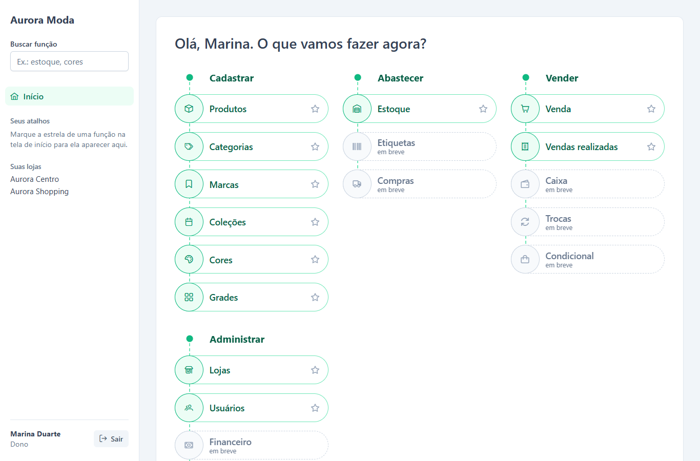
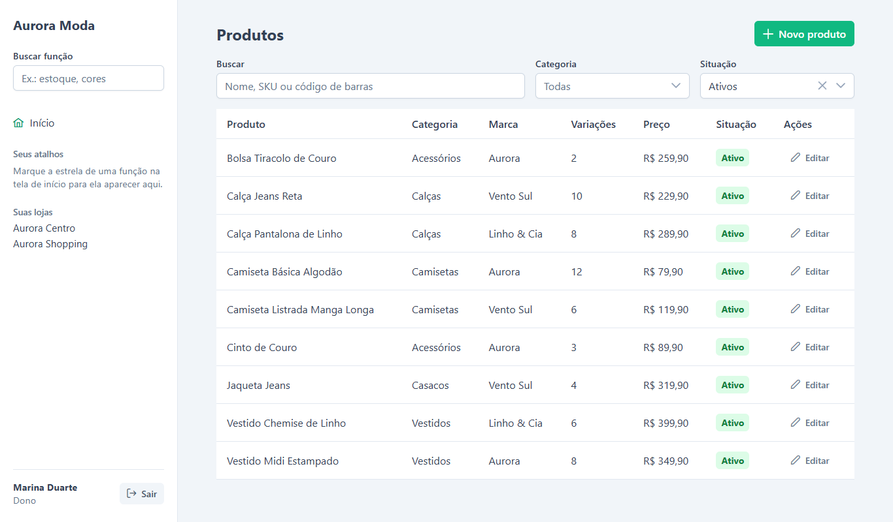
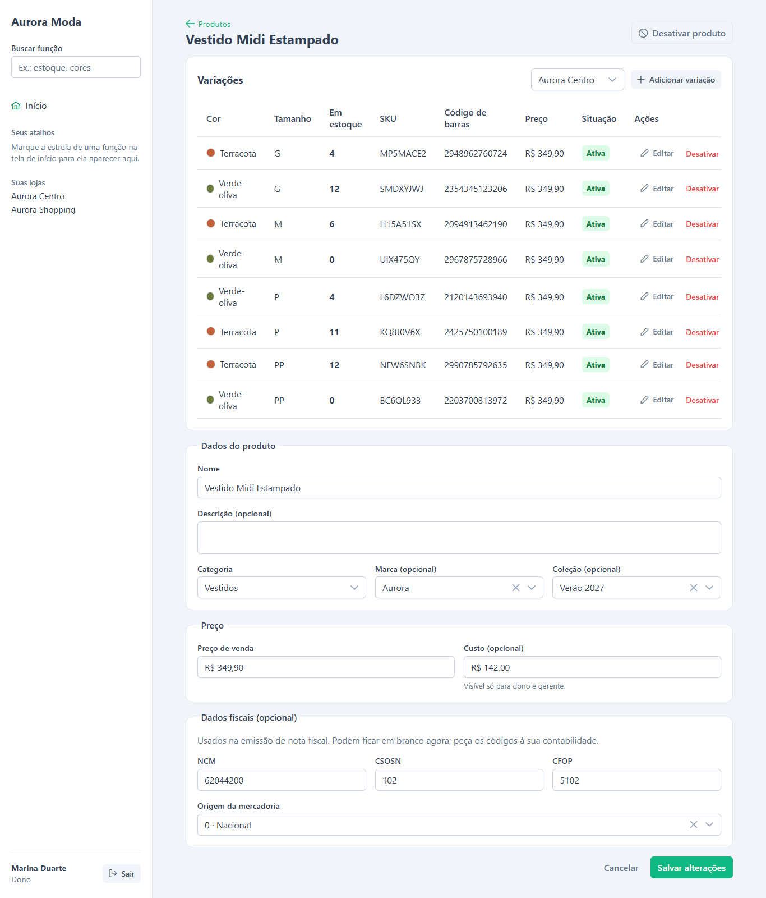
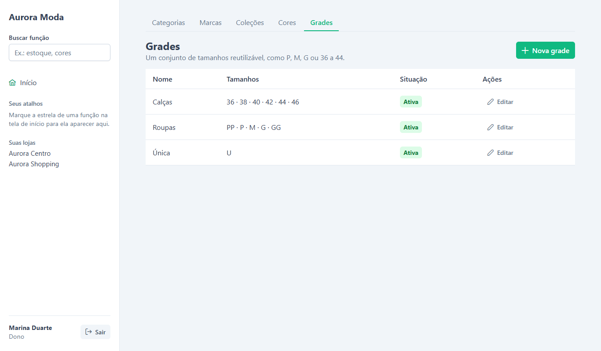
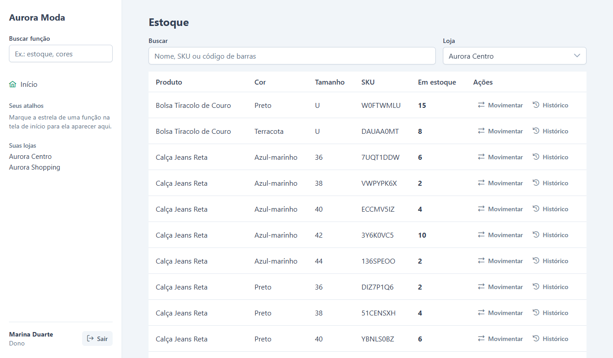
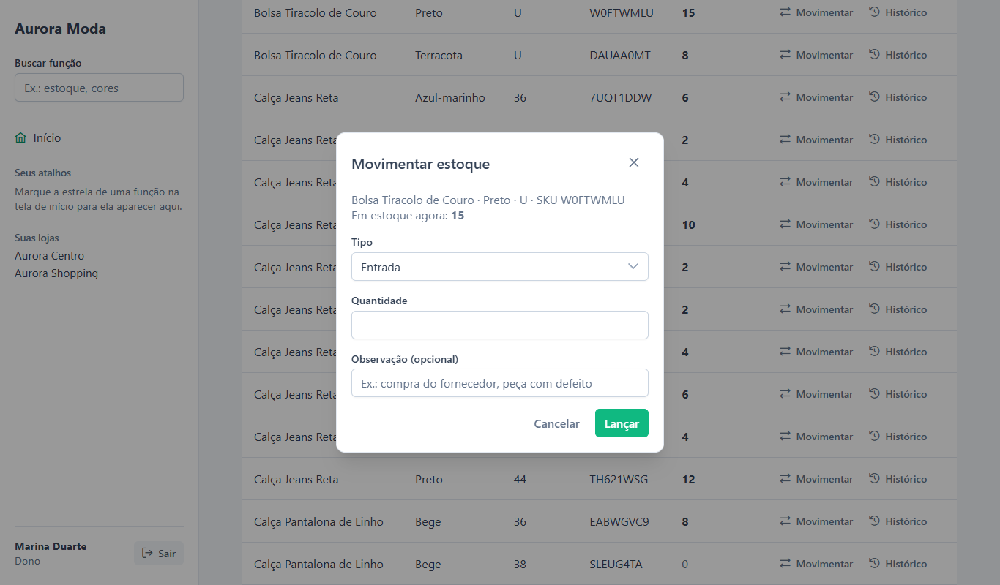
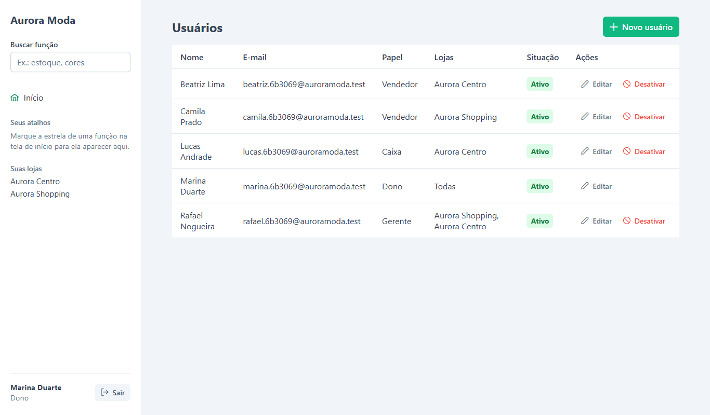
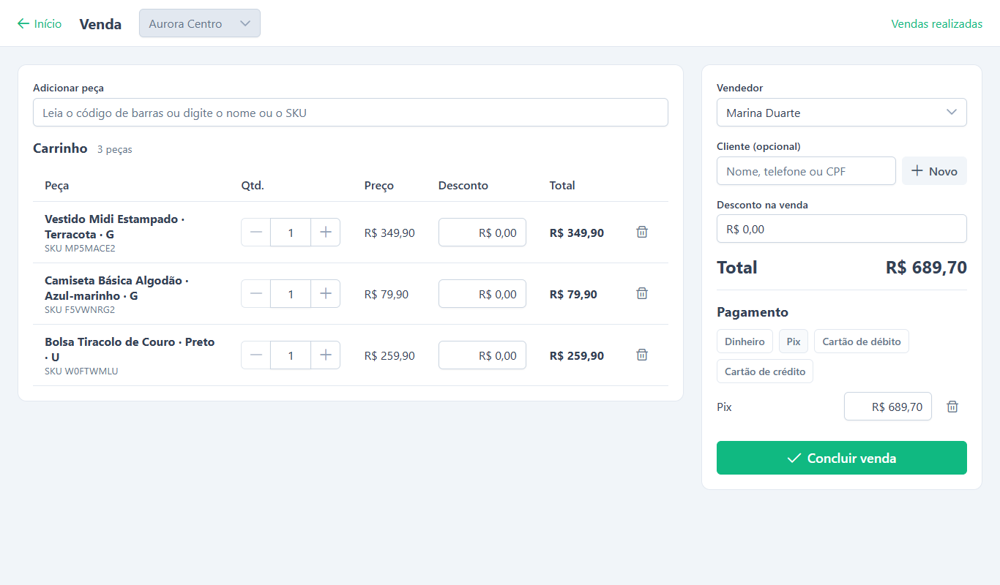
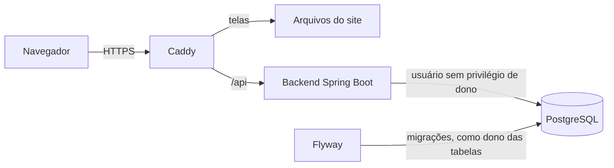

# Vertize

Vertize é um sistema de gestão para lojistas de moda, oferecido como serviço (SaaS): cada lojista tem
sua empresa, com uma ou mais lojas, e usa o sistema pelo navegador. Está publicado em
produção, com HTTPS, em um servidor próprio.

Este repositório é a apresentação do projeto. O código completo fica em um repositório
privado; aqui estão as telas, as decisões de arquitetura e alguns trechos escolhidos.

## O problema

Lojas pequenas e médias de moda costumam controlar estoque e vendas em caderno, planilha
ou em sistemas genéricos, que não tratam o que é próprio do ramo: a mesma peça existe em
várias cores e tamanhos, e é cada combinação que se vende e se conta no estoque.

## O que o sistema faz hoje

| Área | Funções |
|---|---|
| Conta e acesso | Criação da empresa com a primeira loja e o usuário dono; login; sessão retomada ao recarregar a página |
| Lojas e usuários | Várias lojas por empresa; quatro papéis (dono, gerente, vendedor, caixa); cada pessoa vê só as lojas em que trabalha |
| Catálogo | Categorias, marcas, coleções, cores e grades de tamanho; produtos com uma variação por cor e tamanho, SKU e código de barras gerados, preço próprio por variação e campos fiscais |
| Estoque | Saldo de cada variação por loja; entrada, saída e ajuste de contagem; histórico de movimentações que nunca é apagado; relatório com quantidade e valor, com impressão e exportação para planilha |
| Navegação | Tela inicial em mapa de funções, na ordem em que a loja trabalha, com busca e atalhos |

Em construção: a venda no caixa (PDV), com abertura e fechamento de caixa. Planejados: venda
sem internet, troca com vale-troca, condicional e emissão de nota fiscal.

## Telas

As imagens foram capturadas com uma empresa fictícia, criada só para as fotos.

### Catálogo

| Lista de produtos | Produto com variações |
|---|---|
|  |  |

A grade de tamanhos é um cadastro reutilizável. Ao criar um produto, o sistema gera uma
variação para cada combinação de cor e tamanho.

### Estoque

| Saldo por loja | Lançar movimentação |
|---|---|
|  |  |

### Usuários e permissões

### Venda (em construção)

## Tecnologias

| Camada | Escolha |
|---|---|
| Backend | Java 25, Spring Boot 4.1, Spring Security, JPA/Hibernate, Flyway |
| Banco | PostgreSQL 17 |
| Frontend | Vue 3, Vite, TypeScript, Pinia, Vue Router, PrimeVue 4 |
| Testes | JUnit com Testcontainers no backend; Vitest no frontend |
| Publicação | Docker Compose, Caddy com HTTPS automático, VPS Linux |

## Arquitetura

- **Monólito modular.** Um único serviço, com um pacote por módulo (`auth`, `catalogo`,
  `estoque`), cada um dividido em `controller`, `service`, `repository`, `model` e `dto`.
- **Frontend em duas partes.** A pasta `nucleo/` conversa com a API e cuida da sessão sem
  importar nada do Vue; as telas ficam separadas. As telas podem ser refeitas em outro
  framework sem reescrever o comportamento.
- **Contrato antes do código.** Cada parte nova começa por um documento que combina as
  rotas entre frontend e backend.
- **Telas e API no mesmo endereço em produção.** O servidor web entrega as telas e
  encaminha `/api` para o backend, que não fica exposto à internet. O banco também não.

## Decisões de projeto

### Isolamento entre lojistas feito pelo banco

O maior risco de um SaaS é um cliente enxergar dados de outro. Aqui a barreira final não é
o código da aplicação, e sim o PostgreSQL:

- Toda tabela tem `empresa_id` e uma política de Row Level Security.
- A aplicação se conecta com um usuário que não é dono das tabelas, então não consegue
  ignorar as políticas.
- A cada conexão entregue ao Hibernate, o backend informa ao banco qual é a empresa do
  usuário logado; ao devolver a conexão ao pool, apaga essa informação.
- Sem empresa definida, nenhuma linha passa.

Mesmo que uma consulta esqueça o filtro, o banco não devolve linhas de outra empresa. Há
testes automáticos que tentam ler e gravar dados de outra empresa pela API e por SQL direto.

Trechos: [isolamento-no-banco.sql](trechos/isolamento-no-banco.sql) e
[ConexaoPorEmpresa.java](trechos/ConexaoPorEmpresa.java).

### Sessão com token curto e cookie de renovação

- O token de acesso dura 15 minutos e fica só na memória do navegador.
- A renovação usa um cookie `HttpOnly`, `Secure` e `SameSite=Strict`, que o JavaScript não
  consegue ler. No servidor só é guardado o hash dele, e ele é trocado a cada renovação.
- Várias requisições que falham ao mesmo tempo compartilham uma única renovação, e uma
  trava do navegador põe em fila as renovações de abas diferentes.

Trecho: [sessao.ts](trechos/sessao.ts).

### Permissão conferida nos dois lados

O frontend esconde o que o papel não pode fazer e o backend recusa a chamada. O gerente,
por exemplo, não edita o dono, não muda o papel de ninguém e só atribui lojas em que ele
próprio trabalha. Vendedor e caixa nunca recebem o custo dos produtos.

### Estoque como histórico

Cada entrada, saída ou ajuste é uma linha que não é editada nem apagada. Um erro se corrige
com uma movimentação contrária. O saldo é atualizado na mesma transação.

### Publicação reproduzível

O ambiente de produção sobe com um comando. O servidor web obtém e renova o certificado
HTTPS sozinho; só as portas 80 e 443 ficam abertas. Há scripts de backup, restauração e
atualização, e as mudanças de banco são aplicadas pelo backend ao subir. Senhas e segredos
ficam em um arquivo fora do repositório.

Trechos: [docker-compose.producao.yml](trechos/docker-compose.producao.yml) e
[Caddyfile](trechos/Caddyfile).

## Papéis

| O que | Dono | Gerente | Vendedor | Caixa |
|---|---|---|---|---|
| Criar e editar lojas | sim | não | não | não |
| Gerenciar usuários | sim | sim, com limites | não | não |
| Cadastrar produtos | sim | sim | só consulta | só consulta |
| Ver o custo do produto | sim | sim | não | não |
| Lançar movimentação de estoque | sim | sim | só consulta | só consulta |
| Lojas que alcança | todas | as suas | as suas | as suas |

## Testes

- **Backend:** 19 testes de integração, que sobem um PostgreSQL real em contêiner e
  cobrem login, renovação de sessão, isolamento entre empresas, permissões por papel,
  limite de tentativas de login, CORS, catálogo, estoque e relatório de estoque.
- **Frontend:** 72 testes do núcleo: cliente da API, sessão, permissões, formatos, exportação e mapa de
  funções.

## Licença

Este repositório é uma apresentação. Veja [LICENCA.md](LICENCA.md).
